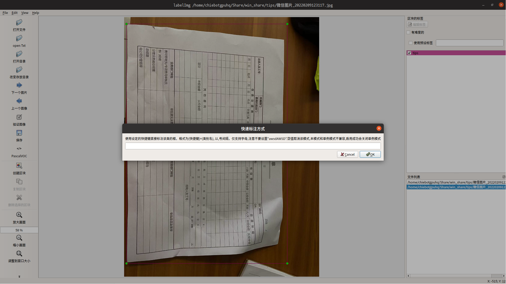

# Introduction
this repo just fork from <https://github.com/tzutalin/labelImg> and add some personal functions

# Changelog
## 新增快捷模式
即,确定要进行快速标注的类别,将除开awds之外的任意字母设置成该类别的快捷键,按该键的效果等同于临时开启单例模式,同时完全兼容现有的标注方式.
使用方法:
1. 选择view -> shortCut
2. 在弹出的文本框中输入以逗号分隔的键值对来设定快捷方式中的快捷键,如将字符串设定为 `q=aqmzc,e=wcaqm,r=gzzc,f=wcgz`,即将qerf四个键设置成`aqmzc`,`wcaqm`,`gzzc`,`wcgz` 四个类别的快捷键.按对应快捷键便会直接画框,并设置对应的标签,省去了选择标签的操作.

**注意事项:**
- 开启快捷方式是否成功的信息会显示在最下方的状态栏中
- 设置成空值可以关闭该功能
- 快捷模式和单例模式互斥

**现在记录样本到1~9的txt时,会在最下方的状态栏中提示**

## 新增样本临时记录功能
按数字键1~9 会将当前样本完整路径记录到对应的文本文件,按0从对应文本文件中去除当前样本的完整路径记录
